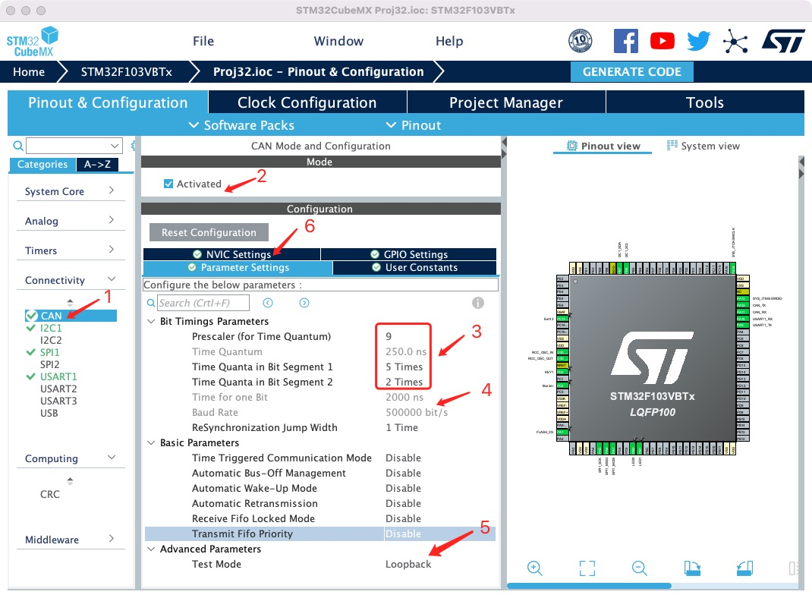
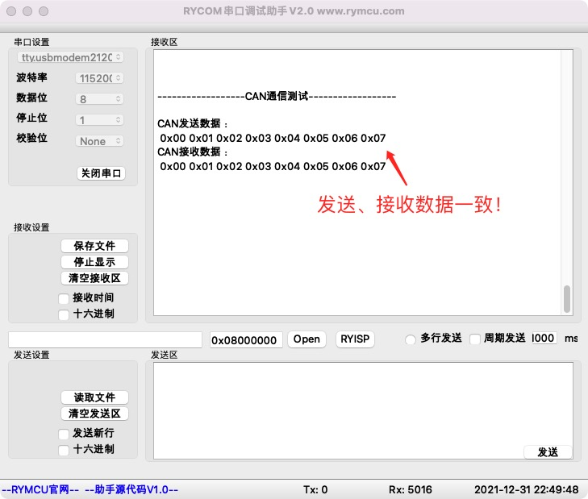

# STM32 HAL库CAN通信

## 1.  前期准备

安装好`STM32CubeMX`

安装好`Clion`

## 2.创建项目

**step1 配置`CAN`外设**

在上一章工程基础上添加`CAN`配置如下：



通过组合图中`3`处参数，设置`CAN`通信波特率为`500K`，如`4`所示。`5`处模式设置为`Loopback`，即自发自收模式，不需要外部`CAN`设备也可以测试功能，正常使用时设置为`Normal`。同时，开启`CAN`接收中断，点击`6`处的`NVIC Settings`,找到`USB low priority or CAN RX0interrupts`选中`Enable`。生成项目即可。

## 3.编辑代码

**step1 启动`CAN`并开启中断**

`main.c`中项目自动创建了`CAN`对象`hcan`：

```c
CAN_HandleTypeDef hcan;
```

并添加了`CAN`初始化的基本代码`MX_CAN_Init(void)`，在该函数的最后手动添加启动`CAN`以及开启中断，代码如下：

```c
  /* USER CODE BEGIN CAN_Init 2 */
    //启动CAN
    if(HAL_CAN_Start(&hcan) != HAL_OK)
    {
        printf("CAN start Fail!\r\n");
    }
    //开启中断,FIFO 0接收消息中断
    HAL_CAN_ActivateNotification(&hcan,CAN_IT_RX_FIFO0_MSG_PENDING);
  /* USER CODE END CAN_Init 2 */
```

**step2 添加`CAN`过滤器设置**

`HAL`库没有自动生成`CAN`过滤，需要进行手动设置，初始化代码如下：

```c
void filter_init(void)
{
    HAL_StatusTypeDef HAL_Status;
    CAN_FilterTypeDef Filter0;
    Filter0.FilterBank = 1;//滤波器编号
    Filter0.FilterMode = CAN_FILTERMODE_IDMASK;
    Filter0.FilterScale = CAN_FILTERSCALE_32BIT;
    Filter0.FilterIdHigh = 0x00;
    Filter0.FilterIdLow = 0x00;
    Filter0.FilterMaskIdHigh = 0x00;
    Filter0.FilterMaskIdLow = 0x00;
    Filter0.FilterFIFOAssignment = CAN_FILTER_FIFO0;
    Filter0.FilterActivation = CAN_FILTER_ENABLE;

    HAL_Status = HAL_CAN_ConfigFilter(&hcan,&Filter0);
    if(HAL_Status != HAL_OK)
    {
        printf("CAN Filter set Fail!code:%d\r\n",HAL_Status);
        Error_Handler();
    }
}
```

在`main.c`的`MX_CAN_Init(void)`函数之后调用即可。

**step3 配置`CAN`接收中断回调函数**

当接收到`CAN`数据后，在回调函数中处理即可，在`main.c`重定义接收中断回调函数如下：

```c
//重定义CAN接收中断回调函数
void HAL_CAN_RxFifo0MsgPendingCallback(CAN_HandleTypeDef *hcan)
{
    HAL_StatusTypeDef HAL_Status;
    if(hcan->Instance == CAN1)
    {
        HAL_Status = HAL_CAN_GetRxMessage(hcan,CAN_RX_FIFO0,&RxHeaderCAN,RxDataCAN);
        if(HAL_Status == HAL_OK)
        {
            //处理接收数据
            CAN_Rx_Flag = 1;
        }
    }
}
```

如上代码所示，将接收数据存储在`RxDataCAN[]`数组中，置位接收完成标志位`CAN_Rx_Flag`。其中，`RxHeaderCAN`、`RxDataCAN`、`CAN_Rx_Flag`为自定义的全局变量。至此，完成了全部`CAN`驱动代码编写。

## 4.CAN发送、接收示例

前面我们将`CAN`设置为`Loopback`模式，即可以接收到自己发送的数据。示例功能为：通过`CAN`发送数据，并接收它，串口打印，对比收发数据是否一致。

在`main.c`中添加代码测试代码：

添加全局变量：

```c
//CAN全局变量
CAN_TxHeaderTypeDef TxHeaderCAN;
CAN_RxHeaderTypeDef RxHeaderCAN;
uint8_t TxDataCAN[8],RxDataCAN[8];
uint8_t CAN_Rx_Flag=0;//CAN接收标志
```

添加发送数据函数：

```c
void CAN_Test(void)
{
    //发送数据CAN
    TxHeaderCAN.ExtId = 0x1800F001;
    TxHeaderCAN.DLC = 8;
    TxHeaderCAN.IDE = CAN_ID_STD;
    TxHeaderCAN.RTR = CAN_RTR_DATA;
    TxHeaderCAN.StdId = 0x01;
    TxHeaderCAN.TransmitGlobalTime = ENABLE;

    uint32_t TxMailBox;
    HAL_StatusTypeDef HAL_Status;
    printf("\r\n\r\n------------------CAN通信测试------------------\r\n\r\n");
    for (int i = 0; i < 8; ++i) TxDataCAN[i] = i;
    printf("CAN发送数据：\r\n");
    for (int i = 0; i < 8; ++i) printf(" 0x%02x",TxDataCAN[i]);
    printf("\r\n");
    HAL_CAN_AddTxMessage(&hcan,&TxHeaderCAN,TxDataCAN,&TxMailBox);
}
```

`main.c`中调用上述`CAN_Test()`完成数据发送，在`main.c`的`while(1)`循环中检测接收标志`CAN_Rx_Flag`，并打印接收数据，代码如下：

```c
 while (1)
  {
      //处理CAN接收数据
      if(CAN_Rx_Flag)
      {
          CAN_Rx_Flag = 0;//清空CAN接收标志
          printf("CAN接收数据：\r\n");
          for(int i = 0;i<8;i++) printf(" 0x%02x",RxDataCAN[i]);
          printf("\r\n");
      }
 }
```

## 4.编译下载

将程序编译下载至开发板，并将开发板连接至`PC`,打开串口调试助手`RYCOM`，并设置为：`115200+8+N+1`，接收结果如下。



## 5.小节

本章学习了`CAN`数据发送、接收功能的具体实现。
