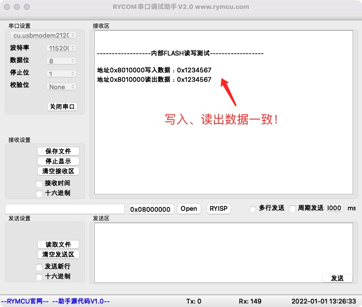

# STM32 HAL库读写内部FLASH

## 1.  前期准备

安装好`STM32CubeMX`

安装好`Clion`

## 2.创建项目

`STM32`内部`FLASH`主要作用存储用户程序代码，多余的可以用来存储用户数据了。例如`FLASH`总大小为`128K`，程序代码只用了`100K`，剩下的`28K`可用来存储我们自己的数据了。内部`FLASH`的读写比较繁琐，需要特定的指令才能完成，本章讲解如何利用`HAL`库函数实现内部`FLASH`的读写。

## 3.编辑代码

组合以下四个`HAL`库函数实现内部`FLASH`的读写：

```c
HAL_FLASH_Lock();//解锁内部FLASH，允许读写
HAL_FLASH_Unlock();//锁定内部FLASH，禁止非授权的操作
HAL_FLASHEx_Erase();//擦除内部FLASH
HAL_FLASH_Program();//内部FLASH编程
```

**step1 编写写内部`FLASH`函数`FLASH_Inside_Wr()`**

```c
/**
  * @brief 往内部FLASH写入数据
  * @param addr 写入地址
  * @param pdata 存储待写数据
  * @retval None
  */
void FLASH_Inside_Wr(uint32_t addr,uint32_t Pdata)
{
    //定义局部变量
    uint32_t PageError = 0;
    HAL_StatusTypeDef HAL_Status;
    //擦除配置信息结构体，包括擦除地址、方式、页数等
    FLASH_EraseInitTypeDef pEraseInit;
    pEraseInit.TypeErase = FLASH_TYPEERASE_PAGES;//按页擦除
    pEraseInit.PageAddress = addr;//擦除地址
    pEraseInit.NbPages = 1;//擦除页数量
    //step1 解锁内部FLASH，允许读写功能
    HAL_FLASH_Unlock();
    //step2 开始擦除addr对应页
    HAL_Status = HAL_FLASHEx_Erase(&pEraseInit,&PageError);//擦除
    if(HAL_Status != HAL_OK) printf("内部FlASH擦除失败！\r\n");
    //step3 写入数据
    HAL_FLASH_Program(FLASH_TYPEPROGRAM_WORD,addr,Pdata);
    //step4 锁定FLASH
    HAL_FLASH_Lock();
}
```

写入数据前，需解锁并擦除，如上代码所示。

**step2 编写读内部`FLASH`函数`FLASH_Inside_Rd()`**

```c
/**
  * @brief 读取内部FLASH数据
  * @param addr 读取地址
  * @retval 读出的数据
  */
uint32_t FLASH_Inside_Rd(uint32_t addr)
{
    //定义局部变量
    uint32_t RdData = 0;
    //step1 解锁内部FLASH，允许读写功能
    HAL_FLASH_Unlock();
    RdData = *(__IO uint32_t *)addr;
    //step2 锁定FLASH
    HAL_FLASH_Lock();

    return RdData;
}
```

直接从内部地址读出数据即可。

## 4.内部FLASH读写示例

在`main.c`中调用如下测试函数：

```c
/**
  * @brief 内部FLASH读写测试
  */
void FLASH_Inside_Test(void)
{
    printf("\r\n\r\n------------------内部FLASH读写测试------------------\r\n\r\n");
    uint32_t addr = 0x08010000;//确保该地址内部FLASH是空余的！
    uint32_t WrData = 0x01234567;//待写入数据
    uint32_t RdData = 0;//存储读取数据

    printf("地址0x%x写入数据：0x%x\r\n",addr,WrData);
    FLASH_Inside_Wr(addr,WrData);//写入数据
    RdData = FLASH_Inside_Rd(addr);//读取数据
    printf("地址0x%x读出数据：0x%x\r\n",addr,RdData);
}
```

## 5.编译下载

将程序编译下载至开发板，并将开发板连接至`PC`,打开串口调试助手`RYCOM`，并设置为：`115200+8+N+1`，接收结果如下。



## 6.小节

本章学习了使用HAL库函数读写内部`FLASH`。
