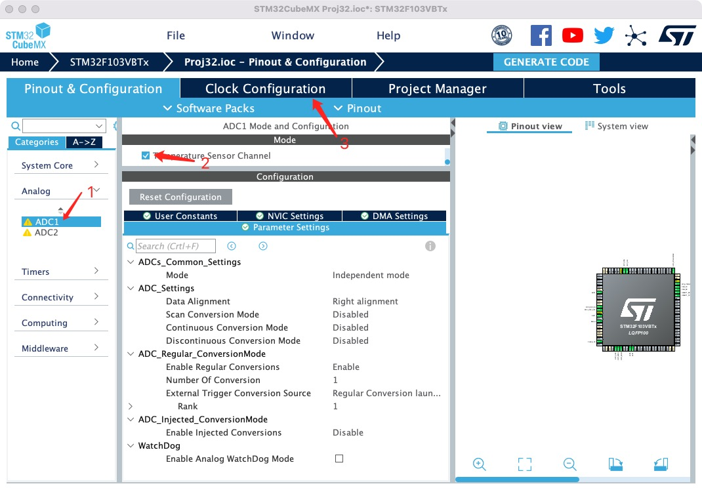
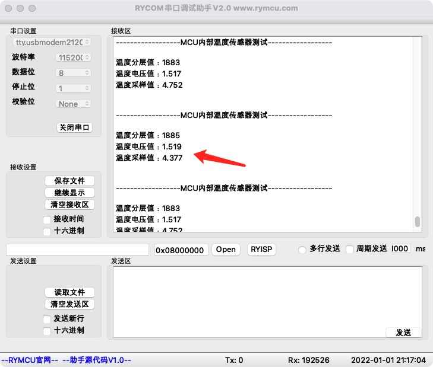

# STM32 内部温度传感器

## 1.  前期准备

安装好`STM32CubeMX`

安装好`Clion`

## 2.创建项目

`STM32`单片机内部集成了一个温度传感器，可以用来实时检测`CPU`温度。测量温度范围为：`-40～125`度，温度传感器和`ADC`的第`16`通道直接相连。因此，只需要通过`ADC`便可采集温度值，`ADC`配置如下：



如上图所示，`1`启动`ADC1`，`2`使能温度采集通道。`3`处的`Clock Configruation`设置`ADC`时钟为`12MHz`。

## 3.编辑代码

项目自动创建了`ADC`对象`hadc1`以及初始化代码如下：

```c
//ADC对象
ADC_HandleTypeDef hadc1;
//系统生成初始化代码
/**
  * @brief ADC1 Initialization Function
  * @param None
  * @retval None
  */
static void MX_ADC1_Init(void)
{
  ADC_ChannelConfTypeDef sConfig = {0};

  hadc1.Instance = ADC1;
  hadc1.Init.ScanConvMode = ADC_SCAN_DISABLE;
  hadc1.Init.ContinuousConvMode = DISABLE;
  hadc1.Init.DiscontinuousConvMode = DISABLE;
  hadc1.Init.ExternalTrigConv = ADC_SOFTWARE_START;
  hadc1.Init.DataAlign = ADC_DATAALIGN_RIGHT;
  hadc1.Init.NbrOfConversion = 1;
  if (HAL_ADC_Init(&hadc1) != HAL_OK)
  {
    Error_Handler();
  }
  sConfig.Channel = ADC_CHANNEL_TEMPSENSOR;
  sConfig.Rank = ADC_REGULAR_RANK_1;
  sConfig.SamplingTime = ADC_SAMPLETIME_1CYCLE_5;
  if (HAL_ADC_ConfigChannel(&hadc1, &sConfig) != HAL_OK)
  {
    Error_Handler();
  }
}
```

`main.c`中编写温度采集函数如下：

```c
/**
  * @brief 读取内部温度传感器
  */
void Get_Temp(void)
{
    uint32_t Temp;//温度采样分层值
    float Vsense = 0.0;//温度采样电压值
    float Temperature = 0.0;//温度值
    //数据手册温度转换公式：T = ((V25-Vsense)/Avg_Slope) + 25
    float V25 = 1.43;//查阅手册获得
    float Avg_Slope = 0.0043;//4.3mV/摄氏度
    printf("\r\n\r\n------------------MCU内部温度传感器测试------------------\r\n\r\n");
    //step1 启动ADC
    HAL_ADC_Start(&hadc1);
    //step2 温度采集转换
    HAL_ADC_PollForConversion(&hadc1,5);
    //step3 转换计算
    Temp = HAL_ADC_GetValue(&hadc1);//获取采样值分层值
    Vsense = Temp *(3.3/4096);//采样精度12bit,最大分层值4096
    Temperature = ((V25-Vsense)/Avg_Slope) + 25;//按公式计算温度值
    //step4 串口打印

    printf("温度分层值：%d\r\n温度电压值：%0.3f\r\n温度采样值：%0.3f\r\n",Temp,Vsense,Temperature);

    HAL_Delay(1000);
}
```

在`main()`函数`while(1)`循环中调用如下：

```c
while (1)
 {
    //采集温度
    Get_Temp();
 }
```

## 4.编译下载

将程序编译下载至开发板，并将开发板连接至`PC`,打开串口调试助手`RYCOM`，并设置为：`115200+8+N+1`，接收结果如下。



## 5.小节

本章学习了`MCU`内部温度传感器的使用。
