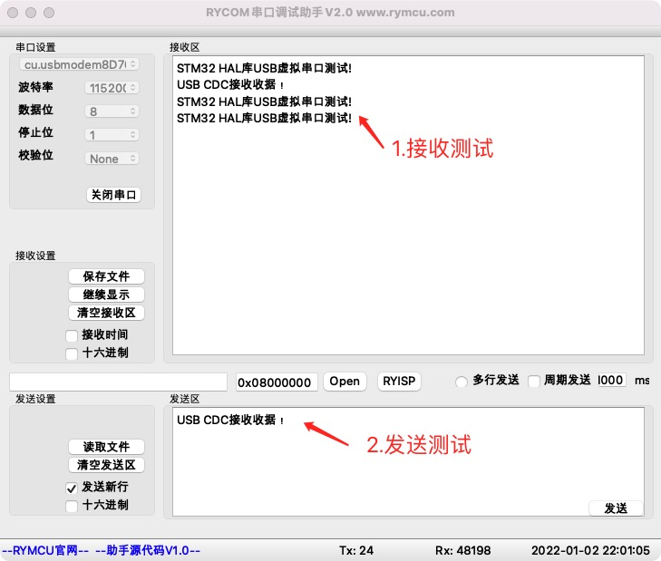

# STM32 HAL库USB虚拟串口

## 1.  前期准备

安装好`STM32CubeMX`

安装好`Clion`

## 2.创建项目

USB虚拟串口配置如下：


USB时钟配置为48MHz。


生成项目前，`Heap Size`，`Stack Size`设置大一点，我这里均设置为`0x1000`。`STM32F103`的`CAN`和`USB`是共用`IO`口的，因此，需要确保没有使用`CAN`功能，这点很关键。

## 3.编辑代码

**step1 虚拟串口发送测试**

项目自动创建了USB初始化代码，main.c中添加头文件及虚拟串口发送测试代码：

```c
#include "usbd_cdc_if.h"
//main函数中日安佳如下代码
  u_char USB_CDC_buff[] = {"STM32 HAL库USB虚拟串口测试!\r\n"};
  while (1)
  {

      CDC_Transmit_FS(USB_CDC_buff, sizeof(USB_CDC_buff));
      HAL_Delay(2000);
 }
```

**step2 虚拟串口接收测试**

在虚拟串口接收函数中，将接收到数据通过虚拟串口原样发送出去：

```c
//函数位于usbd_cdc_if.c文件中
static int8_t CDC_Receive_FS(uint8_t* Buf, uint32_t *Len)
{
  /* USER CODE BEGIN 6 */
//接收到的数据发送回去，此行代码手动添加，其余均自动生成！
  CDC_Transmit_FS(Buf,Len[0]);

  USBD_CDC_SetRxBuffer(&hUsbDeviceFS, &Buf[0]);
  USBD_CDC_ReceivePacket(&hUsbDeviceFS);
  return (USBD_OK);
  /* USER CODE END 6 */
}
```

## 4.编译下载

将程序编译下载至开发板，并将开发板连接至`PC`,打开串口调试助手`RYCOM`，并设置为：`115200+8+N+1`，接收结果如下。



## 5.小节

本章学习了`HAL`库`USB`虚拟串口发送、接收试验。
