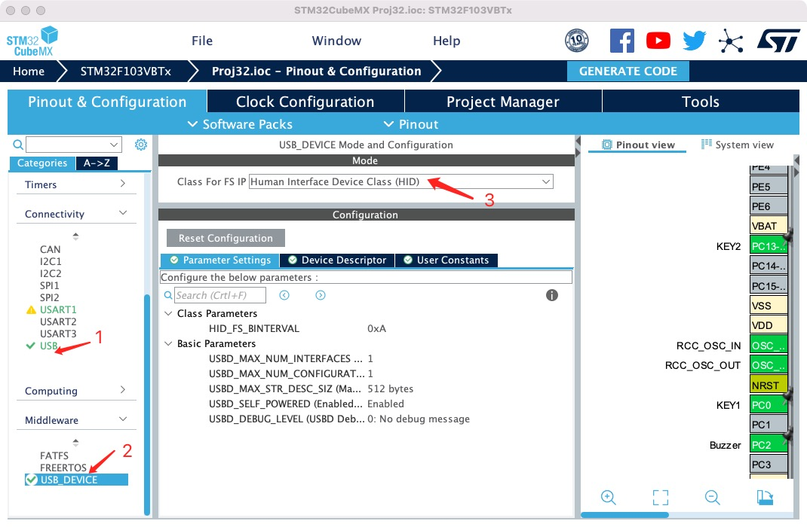
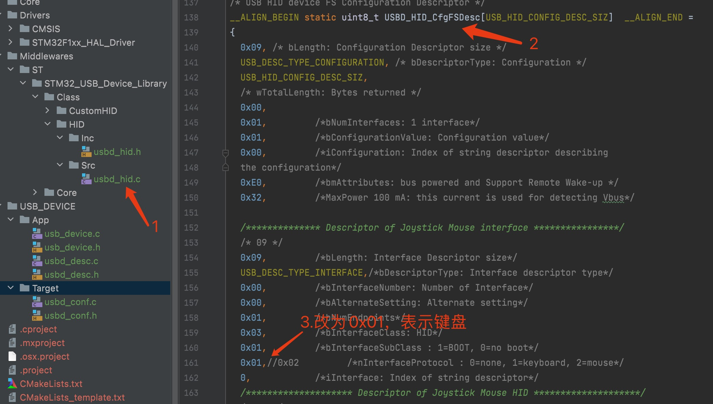
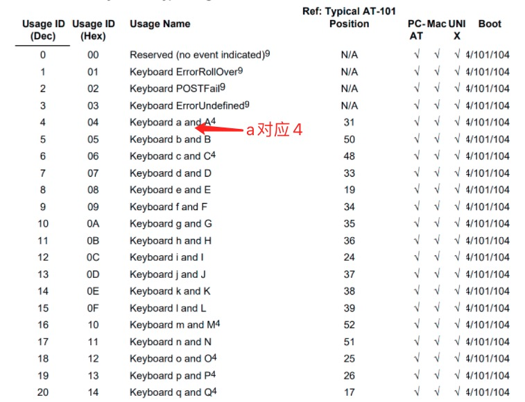
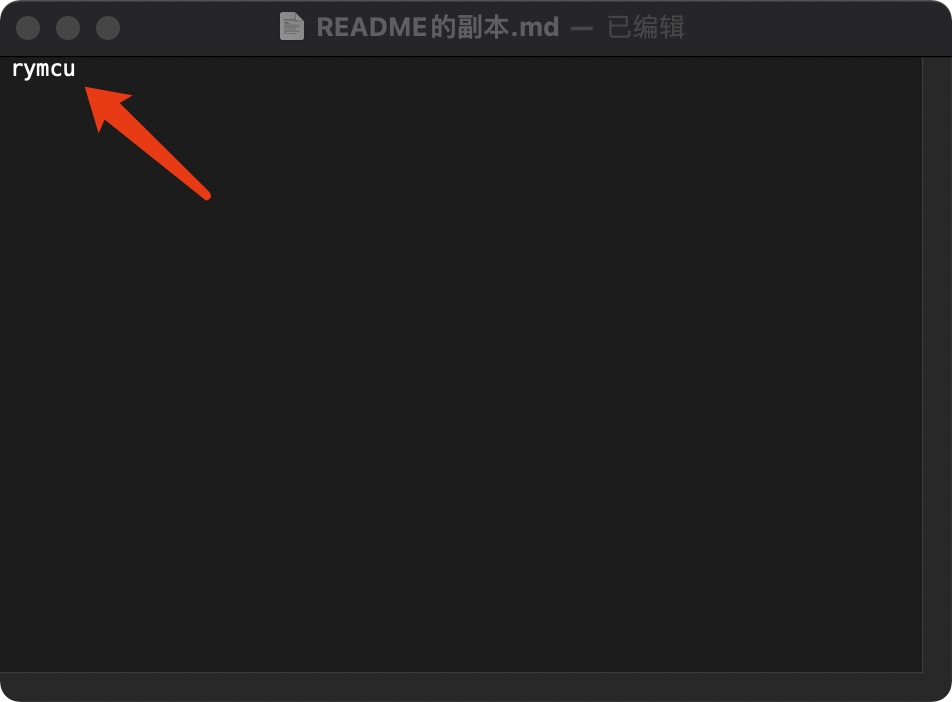

# STM32 HAL库USB HID键盘设备

## 1.  前期准备

安装好`STM32CubeMX`

安装好`clion`

`HAL`库自动生成的`USB HID`项目默认为鼠标设备，在这基础上改造成键盘，并实现模拟键盘输出一串字符。

## 2.创建项目

**在《串口通信》项目基础创建工程。**

**step1 配置USB HID设备**



点击`1`处，选中后`Device(FS)`，`3`处选择`HID`,其他参数默认。

**step2 配置USB 时钟**


`USB`时钟需设置为`48MHz`。

**step3 增加堆栈大小，防止溢出**


## 3.编辑代码

更改为键盘。

**step1 设备描述符改为键盘**

`usbd_hid.c`文件中`USBD_HID_CfgFSDesc[USB_HID_CONFIG_DESC_SIZ]`对应值由`0x02`改为`0x01`。



**step2 报告描述符改为键盘**

`usbd_hid.c`文件中`HID_MOUSE_ReportDesc`数组修改如下：

```c
__ALIGN_BEGIN static uint8_t HID_MOUSE_ReportDesc[HID_MOUSE_REPORT_DESC_SIZE]  __ALIGN_END =
{
        0x05, 0x01,                    // USAGE_PAGE (Generic Desktop)
        0x09, 0x06,                    // USAGE (Keyboard)
        0xa1, 0x01,                    // COLLECTION (Application)
        0x05, 0x07,                    //   USAGE_PAGE (Keyboard)
        0x19, 0xe0,                    //   USAGE_MINIMUM (Keyboard LeftControl)
        0x29, 0xe7,                    //   USAGE_MAXIMUM (Keyboard Right GUI)
        0x15, 0x00,                    //   LOGICAL_MINIMUM (0)
        0x25, 0x01,                    //   LOGICAL_MAXIMUM (1)
        0x75, 0x01,                    //   REPORT_SIZE (1)
        0x95, 0x08,                    //   REPORT_COUNT (8)
        0x81, 0x02,                    //   INPUT (Data,Var,Abs)
        0x95, 0x01,                    //   REPORT_COUNT (1)
        0x75, 0x08,                    //   REPORT_SIZE (8)
        0x81, 0x03,                    //   INPUT (Cnst,Var,Abs)
        0x95, 0x05,                    //   REPORT_COUNT (5)
        0x75, 0x01,                    //   REPORT_SIZE (1)
        0x05, 0x08,                    //   USAGE_PAGE (LEDs)
        0x19, 0x01,                    //   USAGE_MINIMUM (Num Lock)
        0x29, 0x05,                    //   USAGE_MAXIMUM (Kana)
        0x91, 0x02,                    //   OUTPUT (Data,Var,Abs)
        0x95, 0x01,                    //   REPORT_COUNT (1)
        0x75, 0x03,                    //   REPORT_SIZE (3)
        0x91, 0x03,                    //   OUTPUT (Cnst,Var,Abs)
        0x95, 0x06,                    //   REPORT_COUNT (6)
        0x75, 0x08,                    //   REPORT_SIZE (8)
        0x15, 0x00,                    //   LOGICAL_MINIMUM (0)
        0x25, 0xFF,                    //   LOGICAL_MAXIMUM (255)
        0x05, 0x07,                    //   USAGE_PAGE (Keyboard)
        0x19, 0x00,                    //   USAGE_MINIMUM (Reserved (no event indicated))
        0x29, 0x65,                    //   USAGE_MAXIMUM (Keyboard Application)
        0x81, 0x00,                    //   INPUT (Data,Ary,Abs)
        0xc0
};
```

**step3 报告描述符由`74`改为`63`**

```c
//usbd_hid.h
#define HID_MOUSE_REPORT_DESC_SIZE    63U //74U
```

**step4 增加变量声明**

`usb_device.h`中添加外部变量声明，后面`main`函数中要用到。

```c
extern USBD_HandleTypeDef hUsbDeviceFS;
```

## 4.模拟键盘发送字符串示例

`main.c`中添加代码如下：

```c
//添加头文件只支持
#include "usbd_hid.h"
//发送字符串rymcu
  u_char Str[] = {"rymcu"};
  u_char *Pstr = Str;//字符串指针

  uint8_t txbuffer[8]= {0x00,0x00,0x00,0x00,0x00,0x00,0x00,0x00};//空
  uint8_t sendbuffer[8]={0x00,0x00,0x04,0x00,0x00,0x00,0x00,0x00};//发送字母
  //延迟10s,下载程序后，重新插拔USB，将光标挪至文档中，等待输出
  HAL_Delay(10000);

  while(*Pstr)//判断是否到字符串末尾
  {
        sendbuffer[2] = (*Pstr++)-'a'+ 4;//字母a对应4，其他依次增加
        //发送一个字符
        USBD_HID_SendReport(&hUsbDeviceFS,sendbuffer,8);//发送报文
        HAL_Delay(15);
        USBD_HID_SendReport(&hUsbDeviceFS,txbuffer,8);//发送报文
        HAL_Delay(15);

  }
```

如上代码所示，发送报告实现键盘字符的模拟，查询`USB`官方文档可知，字母`a`键值对应`4`，其他类推。代码中延迟`10s`再发送数据，下载程序后，重新插拔`USB`，将光标挪至文档中，等待输出。



## 5.输出测试

程序下载后，重新插拔`USB`，将光标挪至下面文档，输出结果如下：



## 6.小节

本章实现了`HAL`库`USB HID`键盘发送字符串功能。
