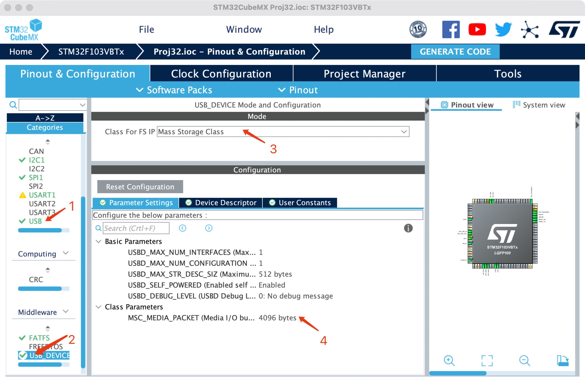
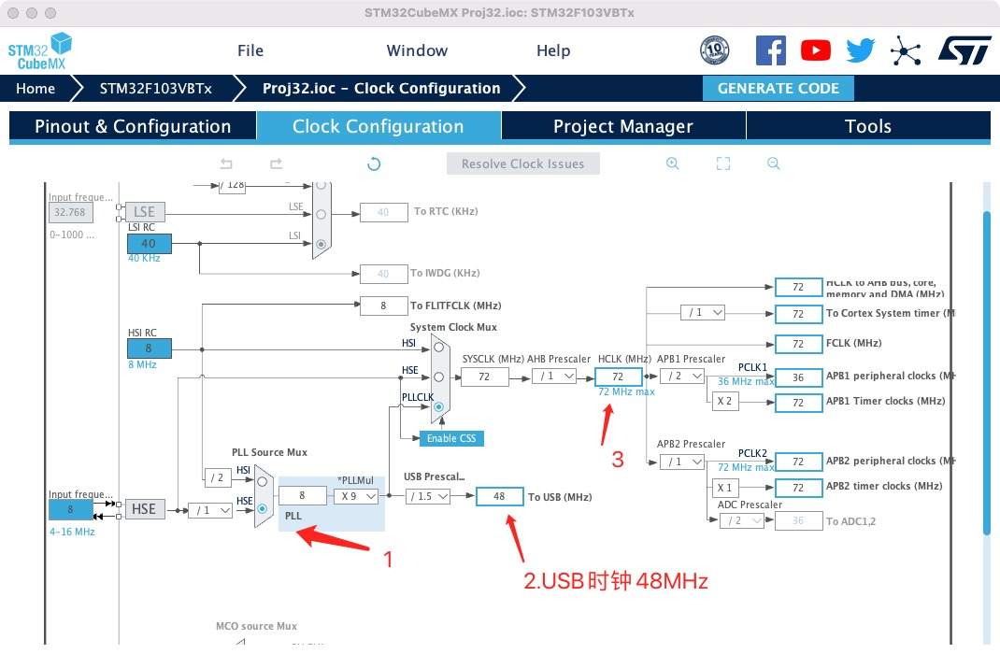
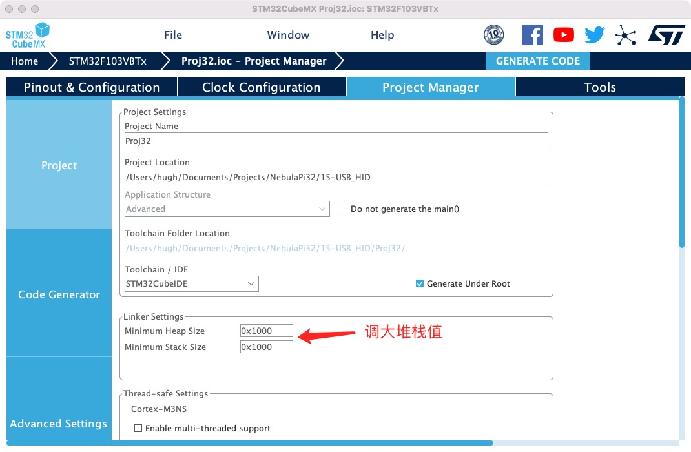
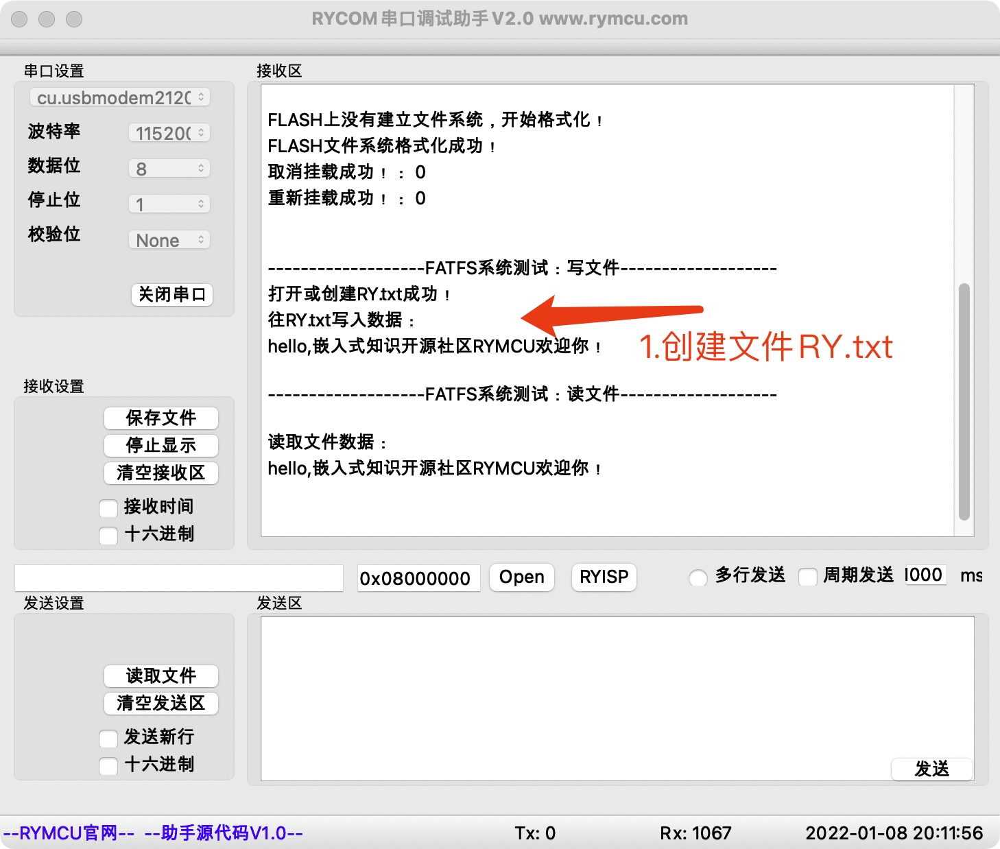
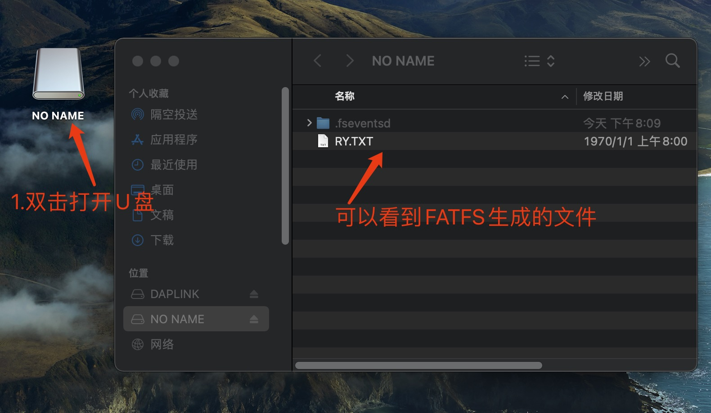

# STM32 HAL库FLASH模拟U盘FATFS

## 1.  前期准备

安装好`STM32CubeMX`

安装好`clion`

实现功能：

使用`SPI FLASH`模拟`U`盘，并在电脑上打开该`U`盘可以看见通过FATFS创建的文件。

## 2.创建项目

**在已移植好文件系统的《FATFS》项目基础上，添加USB模拟U盘的功能。**

**step1 配置`USB MSC`设备**



点击`1`处，选中后`Device(FS)`，`3`处选择`MSC`大容量存储设备,`4`处改为`4096`与`FLASH`扇区大小保持一致，其他参数默认。

**step2 配置USB 时钟**



`USB`时钟需设置为`48MHz`。

**step3 增加堆栈大小，防止溢出**



## 3.编辑代码

**step1 更改`USB`驱动**

找到`usbd_storage_if.c`文件，添加头文件，并添加全局变量：

```c
#include "bsp_spi_flash.h"

#define STORAGE_LUN_NBR                  1
#define STORAGE_BLK_NBR                  256*8 //256*8扇区=8MByte
#define STORAGE_BLK_SIZ                  4096  //每个扇区4096Byte
#define START_SECTOR                     0     //开始扇区
```

**step2 修改`USB`容量获取函数`STORAGE_GetCapacity_FS`**

```c
int8_t STORAGE_GetCapacity_FS(uint8_t lun, uint32_t *block_num, uint16_t *block_size)
{
    /* USER CODE BEGIN 3 */
    *block_num  = STORAGE_BLK_NBR;
    *block_size = STORAGE_BLK_SIZ;
    return (USBD_OK);
    /* USER CODE END 3 */
}
```

**step3 修改`USB`读函数**

```c
int8_t STORAGE_Read_FS(uint8_t lun, uint8_t *buf, uint32_t blk_addr, uint16_t blk_len)
{
    /* USER CODE BEGIN 6 */
    blk_addr+=START_SECTOR;
    SPI_FLASH_BufferRead(buf, blk_addr*STORAGE_BLK_SIZ, blk_len*STORAGE_BLK_SIZ);

    return (USBD_OK);
    /* USER CODE END 6 */
}
```

**step4 修改`USB`写函数**

```c
int8_t STORAGE_Write_FS(uint8_t lun, uint8_t *buf, uint32_t blk_addr, uint16_t blk_len)
{
    /* USER CODE BEGIN 7 */
    uint32_t write_addr;
    blk_addr+=START_SECTOR;
    write_addr = blk_addr*STORAGE_BLK_SIZ;
    SPI_FLASH_SectorErase(write_addr);
    SPI_FLASH_BufferWrite((uint8_t *)buf,write_addr,blk_len*STORAGE_BLK_SIZ);

    return (USBD_OK);
    /* USER CODE END 7 */
}
```

## 4.U盘测试

`main.c`中保留原来`FATFS`文件系统测试函数：

```c
  FATFS_FLASH_Test();
```

**step1 运行代码， `FATFS`成功创建`RY.txt`文件，串口输出如下。**



**step2 `USB`插入`PC`，查看`U`盘内容，可看到`FATFS`文件系统创建的`RY.txt`**

## 

## 5.小节

本章实现了使用`SPI FLASH`模拟`U`盘，并在`U`盘上创建了文件。
