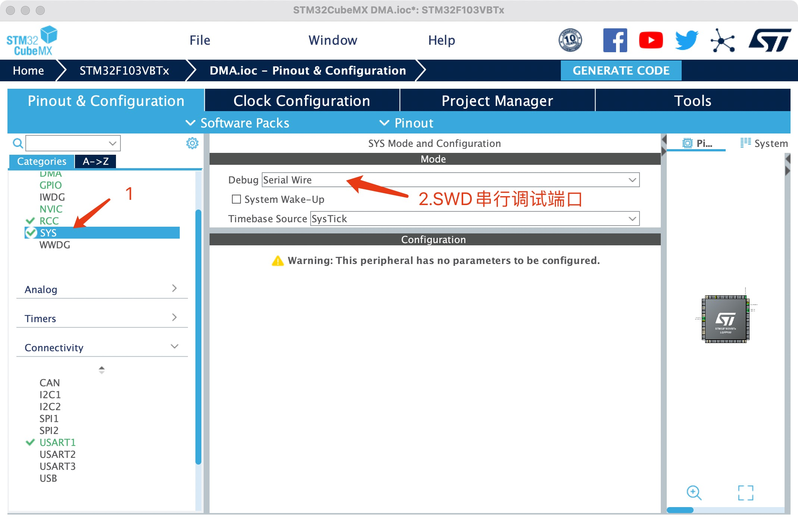
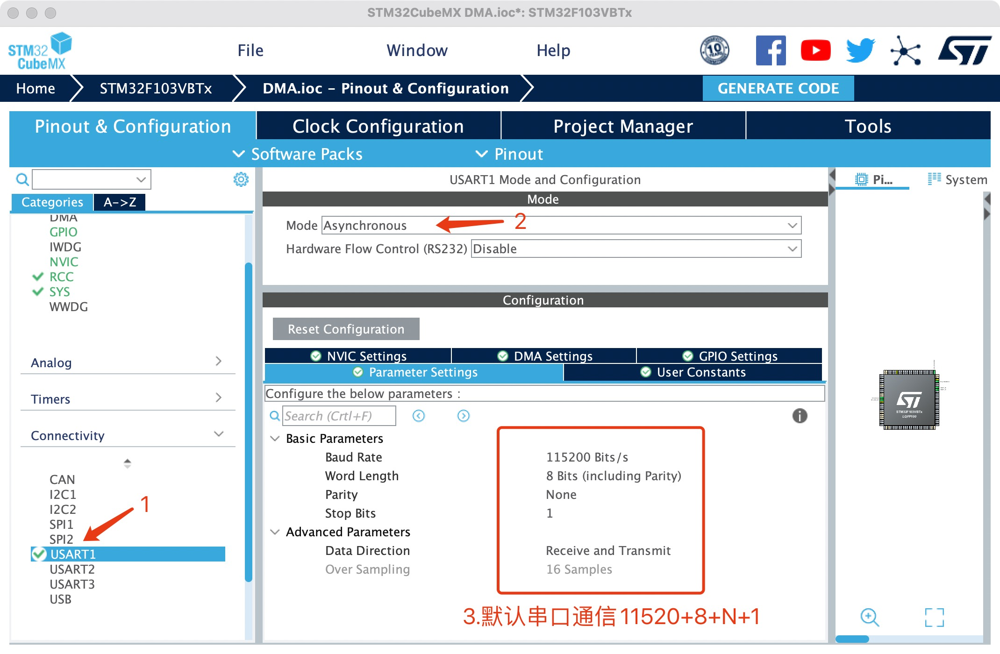
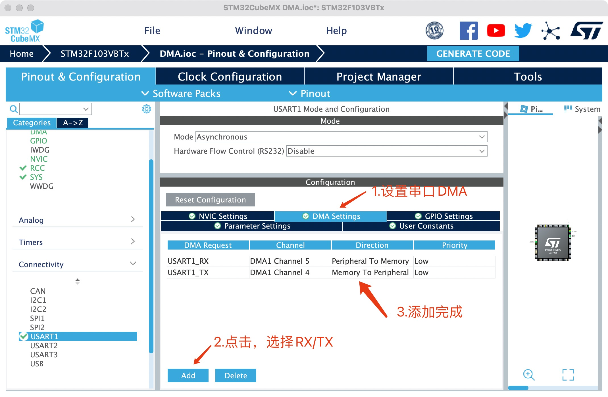
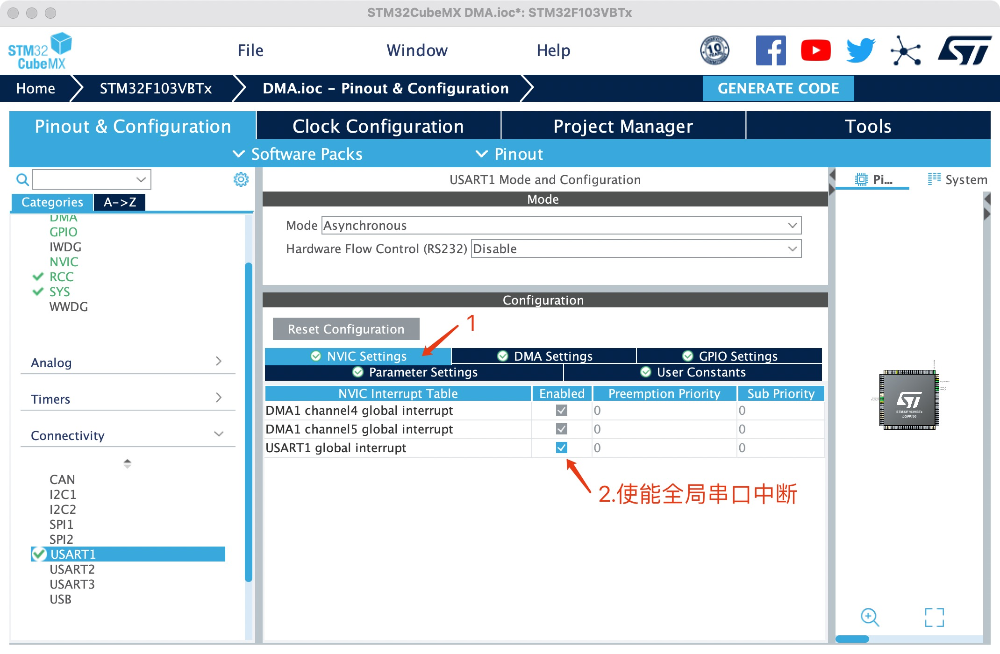
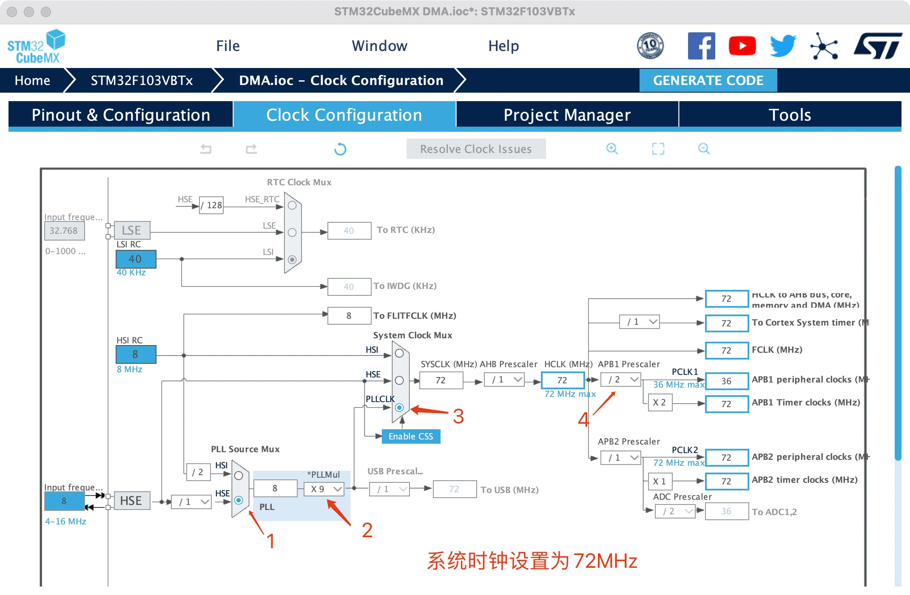
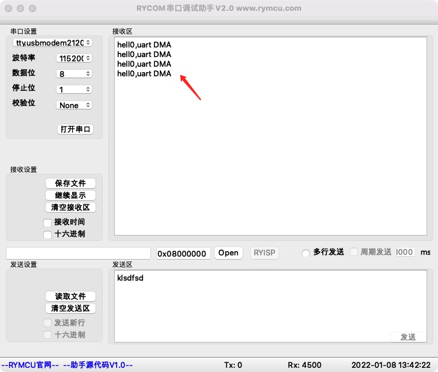
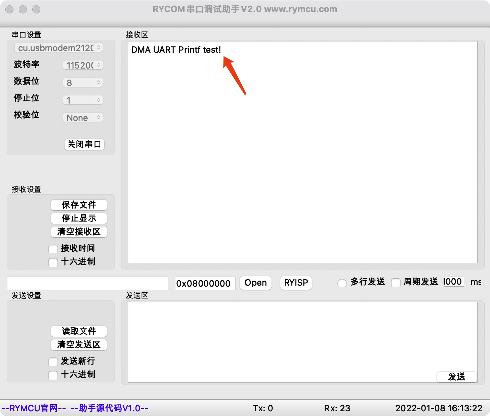
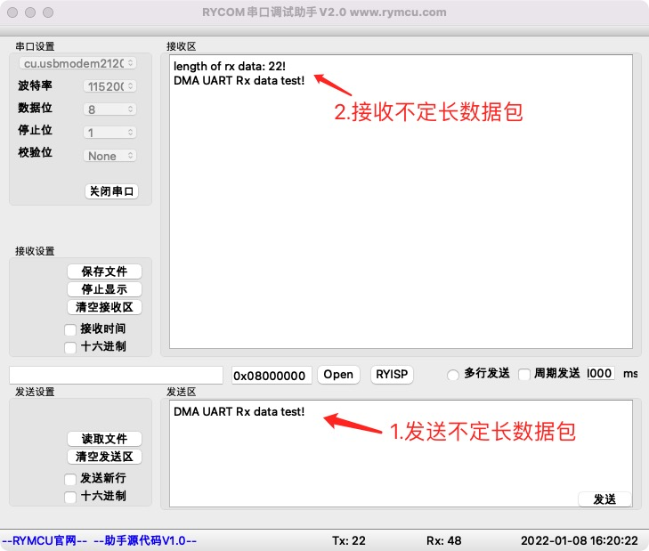

# 串口DMA通信

## 1.  前期准备

安装好`STM32CubeMX`

安装好`clion`

串口`DMA`通信的优点：

串口接收数据时，主程序跳转至串口中断函数中完成数据的接收和存储。如果接收数据比较频繁时，会占用`CPU`大量的时间来接收这些数据。而`DMA`外设的作用就是为了解放`CPU`，由`DMA`来接收数据，`CPU`可以干别的重要事情，当`DMA`接收完成数据后告诉`CPU`即可。

## 2.创建项目

**step1 设置SWD调试端口**



**step2 设置串口**



**step3 设置串口DMA**



**step4 使能串口全局中断**



**step5 设置系统时钟为72MHz**



**生成项目即可。**

## 3.编辑代码

**实现功能为：**

通过`DMA`串口发送字符串。

打开创建的工程，找到源文件夹`Src`的`main.c`，并在`while(1)` 循环中添加添加串口发送语句。`main()`函数中，其他代码均为系统生成的初始化代码，无需理会。

```c
//main.c添加数组声明
#define Buff_Size 100
uint8_t rx_buff[Buff_Size] = "hell0,uart DMA\r\n";
//main函数添加DMA发送代码   
HAL_UART_Transmit_DMA(&huart1, (uint8_t *)rx_buff, sizeof(rx_buff));
HAL_Delay(1000);
```

## 4.编译下载

将程序下载至开发板，并将开发板连接至`PC`,打开串口调试助手`RYCOM`，并设置为：`115200+8+N+1`，接收结果如下。



## 5.添加`printf_DMA`函数

在代码调试过程中，经常使用`printf`函数输出调试信息。我们加`printf_DMA`函数，通过串口输出调试信息。

**step1 `main.c`文件中添加头文件及函数声明**

```c
#include "stdio.h"
#include "stdarg.h"
#include "stm32f1xx_hal_uart.h"

void printf_DMA(const char *format,...);
```

**step2 编写`printf_DMA`函数，代码添加至`main.c`**

```c
//添加DMA串口printf函数
uint8_t _dbg_Buff[150];
void printf_DMA(const char *format,...)
{
    uint32_t length;
    va_list args;
    uint8_t  temp=0;

    va_start(args, format);
    length = vsnprintf((char*)_dbg_Buff, sizeof(_dbg_Buff)+1, (char*)format, args);
    va_end(args);

    HAL_UART_Transmit_DMA(&huart1,_dbg_Buff,length);
    //等待串口发送完成，注意是串口发送完成，不是DMA传输完成
    while(!__HAL_UART_GET_FLAG(&huart1,UART_FLAG_TC));
    //如果没有上面这条语句，连续调用printf_DMA时可能输出错误。
}
```

**step3 `printf`函数输出示例**

`main.c`文件`main()`函数添加代码如下：

```c
   printf_DMA("DMA UART Printf test!\r\n");
```

输出结果如下：



## 6.接收处理不定长的串口数据

单片机串口接收不定长数据时，必须面对的一个问题为，怎么判断这一包数据接收完成了呢？常见的方法主要有以下两种：

- 1.在接收数据时启动一个定时器，在指定时间间隔内没有接收到新数据，则认为数据接收完成；
- 2.在数据中加入帧头、帧尾，通过在程序中判断是否接收到帧尾来确定数据接收完毕。

**这两种方法的缺点为，需要主程序来判断和处理，对主程序造成不小压力。** `STM32` 单片机空闲检测中断可以很好的解决这个问题，他的工作原理为：

当 `STM32` 的串口接收完一包数据后，会产生一个空闲中断。这个中断在串口其他任何状态都不产生，只会在接收完一包数据后才会产生，一包数据可以是 `1 `个字节或者多个字节。因此，我们可以在这个空闲中断函数中，设置一个接收完成标志位。那么，我们只需要在主程序中检测这个标志位就知道数据是否接收完成了。具体应该怎么操作呢？在上述工程基础上，添加相应代码实现接收功能。

**step1 使能串口接收、空闲中断**

在`main.c`的`static void MX_USART1_UART_Init(void)`函数最后添加代码如下：

```c
  /* USER CODE BEGIN USART1_Init 2 */
  //开启空闲中断
  __HAL_UART_ENABLE_IT(&huart1,UART_IT_IDLE);
  //初始化时打开DMA接收，确保第一包数据能够收到！
  HAL_UART_Receive_DMA(&huart1,rx_buff,Buff_Size);
  /* USER CODE END USART1_Init 2 */
```

**step2 添加串口接收全局变量**

`main.h`中声明变量：

```c
/* USER CODE BEGIN ET */
//全局变量定义
#define Buff_Size 100
extern uint8_t rx_buff[100];  //接收缓存
extern uint8_t rx_done; //接收完成标志
extern uint8_t rx_cnt;//接收数据长度
/* USER CODE END ET */
```

`main.c`中变量初始化:

```c
/* USER CODE BEGIN PTD */

uint8_t rx_buff[Buff_Size] = "hell0,uart DMA\r\n";
uint8_t rx_done = 0; //接收完成标志
uint8_t rx_cnt = 0;//接收数据长度
/* USER CODE END PTD */
```

**step3 修改串口中断处理函数**

`stm32f1xx_it.c`文件中找到串口中断函数`void USART1_IRQHandler(void)`,修改代码如下：

```c
void USART1_IRQHandler(void)
{
  /* USER CODE BEGIN USART1_IRQn 0 */

  /* USER CODE END USART1_IRQn 0 */
  HAL_UART_IRQHandler(&huart1);
  /* USER CODE BEGIN USART1_IRQn 1 */
    uint32_t tmp_flag = 0;
    uint32_t temp;

    if(__HAL_UART_GET_FLAG(&huart1,UART_FLAG_IDLE)==SET) //获取IDLE标志位
    {
        rx_done = 1;  // 接受完成标志位置1
        __HAL_UART_CLEAR_IDLEFLAG(&huart1);//清除标志位

        temp  =  __HAL_DMA_GET_COUNTER(&hdma_usart1_rx);// 获取DMA中未传输的数据个数
        rx_cnt =  Buff_Size - temp; //总计数减去未传输的数据个数，得到已经接收的数据个数
        HAL_UART_DMAStop(&huart1); //关闭DMA
        HAL_UART_Receive_DMA(&huart1,rx_buff,Buff_Size);//重新打开DMA接收
    }

  /* USER CODE END USART1_IRQn 1 */
}
```

**step4 处理不定长数据示例**

`main`函数中打印接收到的数据以及长度，代码如下：

```c
    while (1)
    {
    /* USER CODE END WHILE */

        if(rx_done == 1)//判读是否接收完成
        {
            rx_done = 0;//清除接收标志
            //数据处理，打印接收长度、接收的数据
            printf_DMA("length of rx data: %d!\r\n",rx_cnt);
            for(int i = 0;i<rx_cnt;i++) printf_DMA("%c",rx_buff[i]);
            printf_DMA("\r\n");

            rx_cnt =0;//清除接收长度
        }
    /* USER CODE BEGIN 3 */
    }
```

使用串口调试助手发送任意数据，查看接收情况如下：



如上图所示，通`RYCOM`助手发送数据给单片机，单片机正确接收，并正确打印数据及长度。

## 7.小节

本章实现了单片机串口`USART1`发送数据，并定义`printf_DMA`函数，后续调试代码可直接使用。学习了如何通过串口接收不定长数据，并实现数据的处理。
