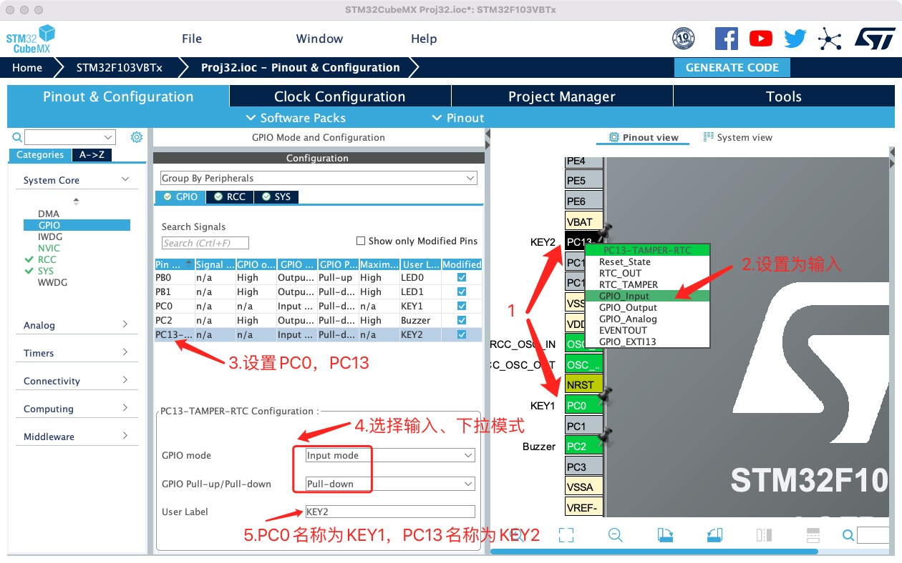

# 蜂鸣器

## 1.前期准备

安装好`STM32CubeMX`

安装好`clion`

## 2.创建项目

**项目创建过程与《点亮你的第一个`LED`灯》基本一致，区别为在`step4`增加添加按键`IO`口设置，`PC0`取名为`KEY1`，`PC13`取名为`KEY2`。**



**并在项目生成阶段`step6`重新设置工程名、存储路径，后续章节创建工程重复部分均不再赘述。**

## 3.编辑代码

打开创建的工程，找到源文件夹`Src`的`main.c`，并在`while(1)` 循环中添加添加按键处理的语句。`main()`函数中，其他代码均为系统生成的初始化代码，无需理会。

```c
   while (1)
  {
      char temp;
      //获取KEY的状态，按下为1，弹起为0
      temp = HAL_GPIO_ReadPin(KEY1_GPIO_Port,KEY1_Pin);//获取按键KEY1状态
      if(temp == 1)
      {   //按下时，点亮LED0
          HAL_GPIO_WritePin(LED0_GPIO_Port,LED0_Pin,GPIO_PIN_RESET);
      }
      else
      {   //弹起时，关闭LED0
          HAL_GPIO_WritePin(LED0_GPIO_Port,LED0_Pin,GPIO_PIN_SET);
      }
    /* USER CODE END WHILE */
    /* USER CODE BEGIN 3 */
  }
```

如上代码所示，先获取按键`KEY1`状态，按下时点亮`LED0`，弹起时关闭`LED0`。

## 4.编译下载

将程序下载至开发板，按下按键`KEY1`，查看`LED0`是否点亮。

## 5.小节

同理可实现`KEY2`对`LED1`的控制。
