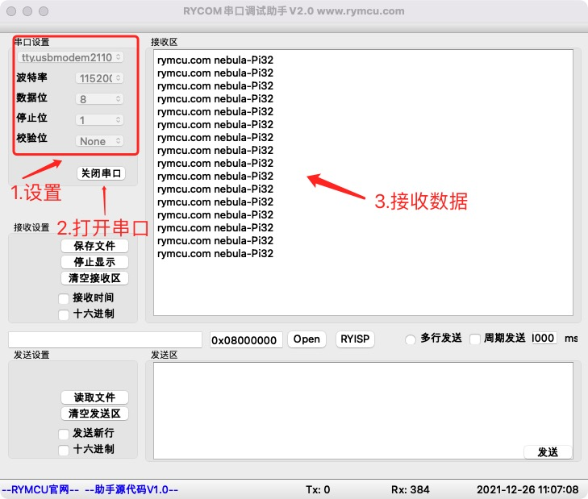

# 串口通信

## 1.  前期准备

安装好`STM32CubeMX`

安装好`clion`

## 2.创建项目

**项目创建过程与《点亮你的第一个`LED`灯》基本一致，区别为在`step4`增加添加串口`USART1`设置。**


**并在项目生成阶段`step6`重新设置工程名、存储路径，后续章节创建工程重复部分均不再赘述。**

## 3.编辑代码

**实现功能为：**

开发板每隔`1s`通过串口`USART1`循环发送字符串`rymcu.com nebula-Pi32`。

打开创建的工程，找到源文件夹`Src`的`main.c`，并在`while(1)` 循环中添加添加串口发送语句。`main()`函数中，其他代码均为系统生成的初始化代码，无需理会。

```c
   while (1)
  {
      unsigned char Sendbuf[]="rymcu.com nebula-Pi32\r\n";
      HAL_UART_Transmit(&huart1,&Sendbuf,sizeof(Sendbuf),1);//串口发送数据
      HAL_Delay(1000);
    /* USER CODE END WHILE */
    /* USER CODE BEGIN 3 */
  }
  /* USER CODE END 3 */
```

## 4.编译下载

将程序下载至开发板，并将开发板连接至`PC`,打开串口调试助手`RYCOM`，并设置为：`115200+8+N+1`，接收结果如下。



## 5.重定义`printf`函数

在代码调试过程中，经常使用`printf`函数输出调试信息。我们重定义`printf`函数，通过串口输出调试信息。

**step1** `main.c`文件中添加头文件

```c
#include "stdio.h"
```

**step2** 重定义`fputc`函数，代码添加至`main.c`

```c
#ifdef __GNUC__
#define PUTCHAR_PROTOTYPE int __io_putchar(int ch)
#else
#define PUTCHAR_PROTOTYPE int fputc(int ch. FILE *f)
#endif /* __GNUC__ */

//重定向printf函数
PUTCHAR_PROTOTYPE
{
    HAL_UART_Transmit(&huart1,(uint8_t *)&ch,1,0xFFFF);//输出指向串口USART1
    return ch;
}
```

`printf`函数实际上通过调用`fputc`函数实现输出，因此如上代码所示，在`fputc`函数中输出指向串口`UART1`即可。

**step3** `printf`函数输出示例

`main.c`文件`while(1)`函数添加代码如下：

```c
  while (1)
  {
      printf("hello,enjoy!\r\n");
      HAL_Delay(1000);
    /* USER CODE END WHILE */
    /* USER CODE BEGIN 3 */
  }
```

输出结果如下：


## 6.接收处理不定长的串口数据

单片机串口接收不定长数据时，必须面对的一个问题为，怎么判断这一包数据接收完成了呢？常见的方法主要有以下两种：

- 1.在接收数据时启动一个定时器，在指定时间间隔内没有接收到新数据，则认为数据接收完成；
- 2.在数据中加入帧头、帧尾，通过在程序中判断是否接收到帧尾来确定数据接收完毕。

**这两种方法的缺点为，需要主程序来判断和处理，对主程序造成不小压力。** `STM32` 单片机空闲检测中断可以很好的解决这个问题，他的工作原理为：

当 `STM32` 的串口接收完一包数据后，会产生一个空闲中断。这个中断在串口其他任何状态都不产生，只会在接收完一包数据后才会产生，一包数据可以是 `1 `个字节或者多个字节。因此，我们可以在这个空闲中断函数中，设置一个接收完成标志位。那么，我们只需要在主程序中检测这个标志位就知道数据是否接收完成了。具体应该怎么操作呢？在上述工程基础上，添加相应代码实现接收功能。

**step1 使能串口接收、空闲中断**

在`main.c`的`static void MX_USART1_UART_Init(void)`函数最后添加代码如下：

```c
  /* USER CODE BEGIN USART1_Init 2 */
  //开启接收中断，空闲中断
  __HAL_UART_ENABLE_IT(&huart1,UART_IT_IDLE|UART_IT_RXNE);
  /* USER CODE END USART1_Init 2 */
```

**step2 添加串口接收全局变量**

`main.h`中声明变量：

```c
/* USER CODE BEGIN ET */
//全局变量定义
extern uint8_t rx_buff[100];  //接收缓存
extern uint8_t rx_done; //接收完成标志
extern uint8_t rx_cnt;//接收数据长度
/* USER CODE END ET */
```

`main.c`中变量初始化:

```c
/* USER CODE BEGIN PTD */
uint8_t rx_buff[100];  //接收缓存
uint8_t rx_done = 0; //接收完成标志
uint8_t rx_cnt = 0;//接收数据长度
/* USER CODE END PTD */
```

**step3 修改串口中断处理函数**

`stm32f1xx_it.c`文件中找到串口中断函数`void USART1_IRQHandler(void)`，并注释系统处理函数`HAL_UART_IRQHandler(&huart1);`,修改代码如下：

```c
void USART1_IRQHandler(void)
{
  /* USER CODE BEGIN USART1_IRQn 0 */
    uint8_t temp;
    if(__HAL_UART_GET_FLAG(&huart1,UART_FLAG_RXNE)  == SET)//接收到一个字节，进入一次接收中断
    {
        HAL_UART_Receive(&huart1,&rx_buff[rx_cnt++],1,0); //将接收的数据存入rx_buff中
        if(rx_cnt >= 100) rx_cnt = 0;                //每包数据不能超过接收buff的总长度
        __HAL_UART_CLEAR_FLAG(&huart1,UART_FLAG_RXNE);//清除接收中断标志
    }

    if(__HAL_UART_GET_FLAG(&huart1,UART_FLAG_IDLE) == SET)//接收完数据后进入空闲中断
    {
     // __HAL_UART_CLEAR_FLAG(&huart1,UART_FLAG_IDLE);//这条语句对空闲中断无效
        __HAL_UART_CLEAR_PEFLAG(&huart1);//使用这条完成idle中断的清零，否则会一直进入中断
        rx_done = 1; //检测到空闲状态，置位接收完成位
    }
    /* USER CODE END USART1_IRQn 0 */
  //HAL_UART_IRQHandler(&huart1);//注释系统自带中断处理，使用上面语句完成中断处理
  /* USER CODE BEGIN USART1_IRQn 1 */
  /* USER CODE END USART1_IRQn 1 */
}
```

**step4 处理不定长数据示例**

`main`函数中打印接收到的数据以及长度，代码如下：

```c
  while (1)
  {
      if(rx_done == 1)//判读是否接收完成
      {
          rx_done = 0;//清除接收标志
          //数据处理，打印接收长度、接收的数据
          printf("length of rx data: %d!\r\n",rx_cnt);
          for(int i = 0;i<rx_cnt;i++) printf("%c",rx_buff[i]);
          printf("\r\n");

          rx_cnt =0;//清除接收长度
      }
    /* USER CODE END WHILE */
    /* USER CODE BEGIN 3 */
  }
```

使用串口调试助手发送任意数据，查看接收情况如下：


如上图所示，通`RYCOM`助手发送`30`字节数据给单片机，单片机正确接收，并正确打印数据及长度。

## 7.小节

本章实现了单片机串口`USART1`发送数据，并重定义`printf`函数，后续调试代码可直接使用。学习了如何通过串口接收不定长数据，并实现数据的处理。
