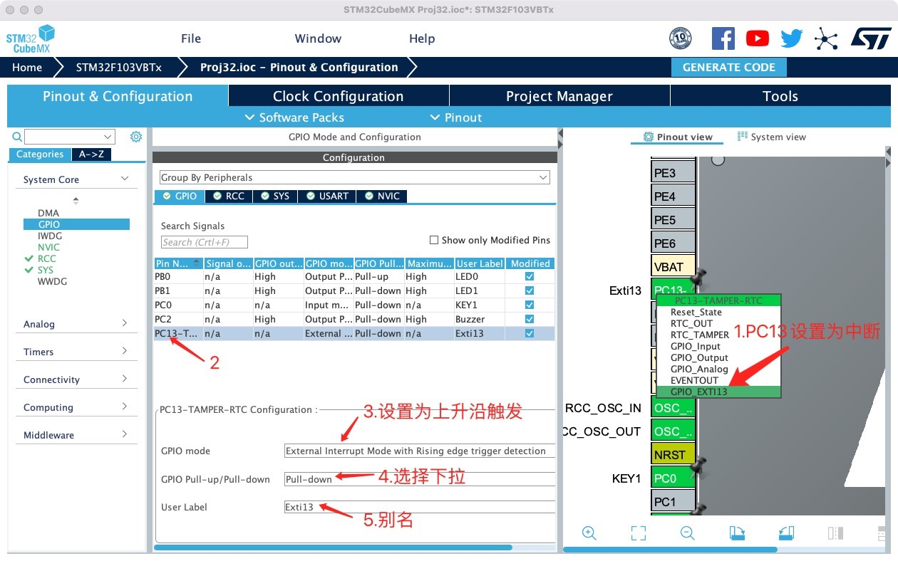
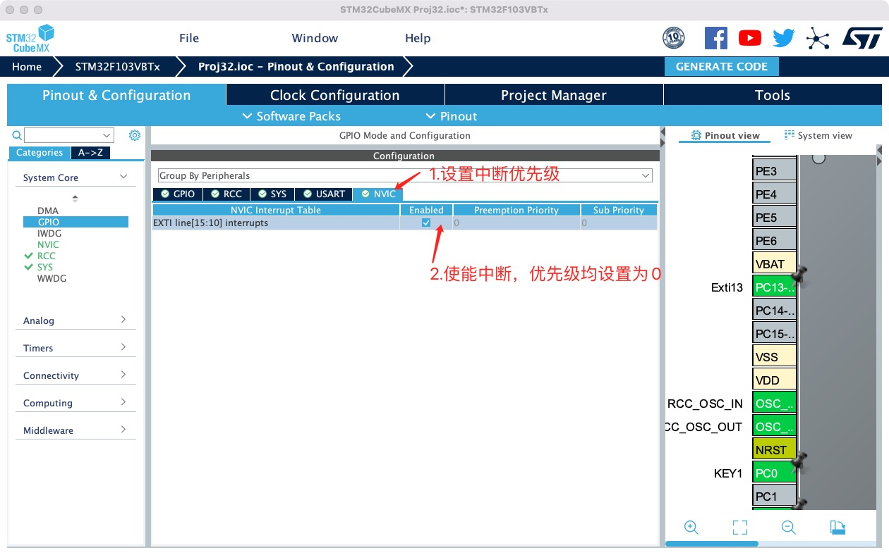
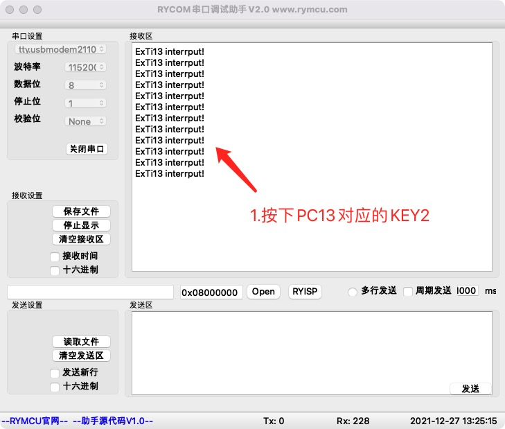

# 外部中断

## 1.  前期准备

安装好`STM32CubeMX`

安装好`Clion`

## 2.创建项目

**使用`KEY2`对应的引脚`PC13`作为外部中断的输入源，按下按键来模拟外部中断。在《串口通信》项目基础上，设置外部中断引脚`PC13`如下图所示。**



按键没按下时，`PC13`引脚为低电平`0V`，按键按下时，`PC13`为高电平`3.3V`。因此，按键按下的过程为从`0V`跳到`3.3V`，即在`PC13`引脚产生了一个上升沿，如上图3所示，中断检测设置为上升沿触发。当`KEY2`按下时，单片机便能捕捉到该动作，从而可以进行相应的处理。

使能中断如下所示。



## 3.编辑代码

系统自动生成的初始化代码如下：

```c
  //初始化代码位于main.c的MX_GPIO_Init(void)函数中
  HAL_NVIC_SetPriority(EXTI15_10_IRQn, 0, 0);
  HAL_NVIC_EnableIRQ(EXTI15_10_IRQn);
```

当单片机捕捉到中断（即按下`KEY2`的动作）后，进入外部中断处理函数：

```c
void EXTI15_10_IRQHandler(void)
{
  /* USER CODE BEGIN EXTI15_10_IRQn 0 */
  /* USER CODE END EXTI15_10_IRQn 0 */
  HAL_GPIO_EXTI_IRQHandler(Exti13_Pin);
  /* USER CODE BEGIN EXTI15_10_IRQn 1 */
  /* USER CODE END EXTI15_10_IRQn 1 */
}
```

上面函数由系统自动生成，位于`stm32f1xx_it.c`文件中，函数中进一步调用`HAL_GPIO_EXTI_IRQHandler(Exti13_Pin)`,具体定义如下：

```c
void HAL_GPIO_EXTI_IRQHandler(uint16_t GPIO_Pin)
{
  /* EXTI line interrupt detected */
  if (__HAL_GPIO_EXTI_GET_IT(GPIO_Pin) != 0x00u)
  {
    __HAL_GPIO_EXTI_CLEAR_IT(GPIO_Pin);
    HAL_GPIO_EXTI_Callback(GPIO_Pin);
  }
}
```

上述函数中，首先清除中断标志位，然后调用`HAL_GPIO_EXTI_Callback(GPIO_Pin)`,如下：

```c
__weak void HAL_GPIO_EXTI_Callback(uint16_t GPIO_Pin)
{
  /* Prevent unused argument(s) compilation warning */
  UNUSED(GPIO_Pin);
  /* NOTE: This function Should not be modified, when the callback is needed,
           the HAL_GPIO_EXTI_Callback could be implemented in the user file
   */
}
```

也就是说，真正的中断处理在`HAL_GPIO_EXTI_Callback()`函数中进行，因此，我门只需要在该函数中添加代码即可。如上图所示，函数前面有`__weak`字样，我们可以在`main.c`文件中重新定义该函数，并添加中断处理代码，接收到中断后，系统将自动跳转到重定义函数中执行。

`main.c`中重写函数如下：

```c
//重写GPIO中断回调函数
void HAL_GPIO_EXTI_Callback(uint16_t GPIO_Pin)
{
    //翻转LED0
    HAL_GPIO_TogglePin(LED0_GPIO_Port,LED0_Pin);
    //打印中断处理信息
    printf("ExTi13 interrput!\r\n");
}
```

如上代码所示，当检测到按键`KEY2`按下时，翻转`LED0`，并通过串口打印信息。

## 4.编译下载

将程序下载至开发板，并将开发板连接至`PC`,打开串口调试助手`RYCOM`，并设置为：`115200+8+N+1`，接收结果如下。



## 5.小节

本章学习了使用`KEY2`模拟外部中断，并进行了中断处理。
