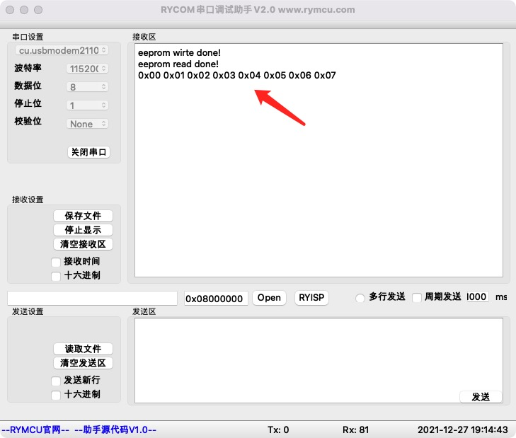

# IIC通信

## 1.  前期准备

安装好`STM32CubeMX`

安装好`Clion`

## 2.创建项目

**配置IIC外设，如下图所示。**


开发板上的`EEPROM`存储设备`AT24Cxx`与单片机之间通过`IIC`协议通信，并且连接至单片机的`PB6`,`PB7`引脚，即对应上图的`I2C1`外设。配置`I2C1`实现对`AT24Cxx`的读写操作。

## 2.编辑代码

`main.c`文件中自动生成了`I2C1`对象以及初始化代码：

```c
 //I2C1对象
 I2C_HandleTypeDef hi2c1;
 //根据配置自动生成初始化代码，并在main函数中进行了调用
 static void MX_I2C1_Init(void)
{
  hi2c1.Instance = I2C1;
  hi2c1.Init.ClockSpeed = 100000;
  hi2c1.Init.DutyCycle = I2C_DUTYCYCLE_2;
  hi2c1.Init.OwnAddress1 = 0;
  hi2c1.Init.AddressingMode = I2C_ADDRESSINGMODE_7BIT;
  hi2c1.Init.DualAddressMode = I2C_DUALADDRESS_DISABLE;
  hi2c1.Init.OwnAddress2 = 0;
  hi2c1.Init.GeneralCallMode = I2C_GENERALCALL_DISABLE;
  hi2c1.Init.NoStretchMode = I2C_NOSTRETCH_DISABLE;
  if (HAL_I2C_Init(&hi2c1) != HAL_OK)
  {
    Error_Handler();
  }
```

同时在项目中自动添加了`stm32f1xx_hal_i2c.h`,`stm32f1xx_hal_i2c.c`文件，其中2个关键函数用来实现读写AT24Cxx：

```c
HAL_I2C_Mem_Write(I2C_HandleTypeDef *hi2c, uint16_t DevAddress, uint16_t MemAddress, uint16_t MemAddSize, uint8_t *pData, uint16_t Size, uint32_t Timeout);
HAL_I2C_Mem_Read (I2C_HandleTypeDef *hi2c, uint16_t DevAddress, uint16_t MemAddress, uint16_t MemAddSize, uint8_t *pData, uint16_t Size, uint32_t Timeout)数
```

参数定义如下：

* hi2c ：I2C对象指针 
* DevAddress 器件地址，本章表示AT24Cxx器件的读或写地址
* MemAddress ：需要读或写内部存储器的首地址  
* MemAddSize：内部地址大小，支持8bit或16bit 
* pData ：需要读或写数据buff指针
* Size ：读或写数据大小 
* Timeout ：操作超时时间

## 3.读写AT24Cxx示例

`mian.c`文件中添加全局变量及测试函数：

```c
//IIC全局变量
#define ADDR_WR_AT24CXX 0xA0 //写器件地址
#define ADDR_RD_AT24CXX 0xA1 //读器件地址
#define BuffSize 256
uint8_t Wr_buff[BuffSize],Rd_buff[BuffSize];//读写数据buff
```

编写读、写测试函数：

```c
//EEPROM测试
void EEPROM_IIC_Test(void)
{
    HAL_StatusTypeDef error;
    uint8_t length = 8 ;
    for(uint16_t i = 0;i<256;i++) Wr_buff[i] = i;
    //AT24Cxx地址00开始写入8Byte数据
    error = HAL_I2C_Mem_Write(&hi2c1,ADDR_WR_AT24CXX,0x00,I2C_MEMADD_SIZE_16BIT,Wr_buff,length,1000);
    if(error == HAL_OK) printf("eeprom wirte done!\r\n");
    else                printf("eeprom wirte fail!\r\n");
    HAL_Delay(1000);
    //从地址0x00开始读8Byte数据，并打印。
    error = HAL_I2C_Mem_Read(&hi2c1,ADDR_RD_AT24CXX,0x00,I2C_MEMADD_SIZE_16BIT,Rd_buff,length,1000);
    if(error == HAL_OK)
    {
        printf("eeprom read done!\r\n");
        for(uint16_t i=0;i<length;i++)
        {
            printf("0x%02x ",Rd_buff[i]);
        }
        printf("\r\n");
    }
    else  printf("eeprom wirte fail!\r\n");
}
```

在`main`函数中调用`EEPROM_IIC_Test()`。


## 4.编译下载

将程序编译下载至开发板，并将开发板连接至`PC`,打开串口调试助手`RYCOM`，并设置为：`115200+8+N+1`，接收结果如下。



## 3.小节

本章学习了通过IIC总线读写EEPROM器件AT24Cxx，掌握了基本的读写操作。
