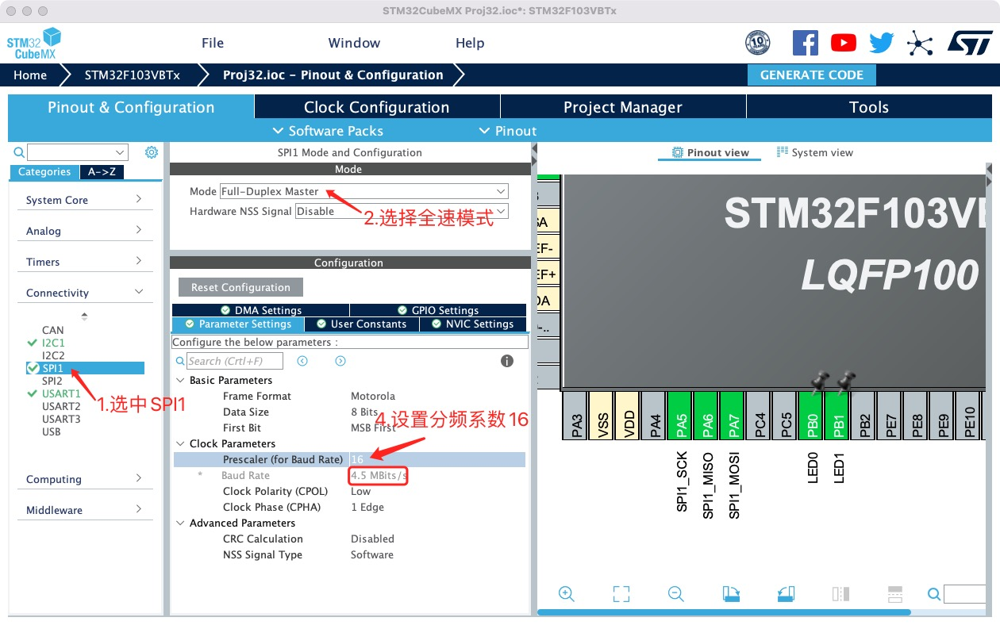
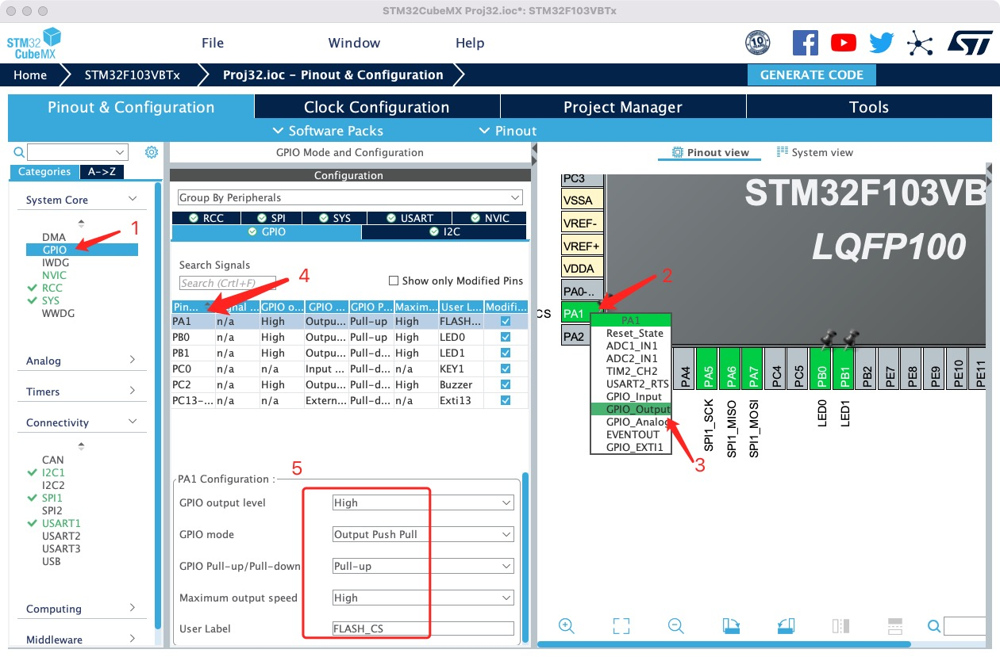
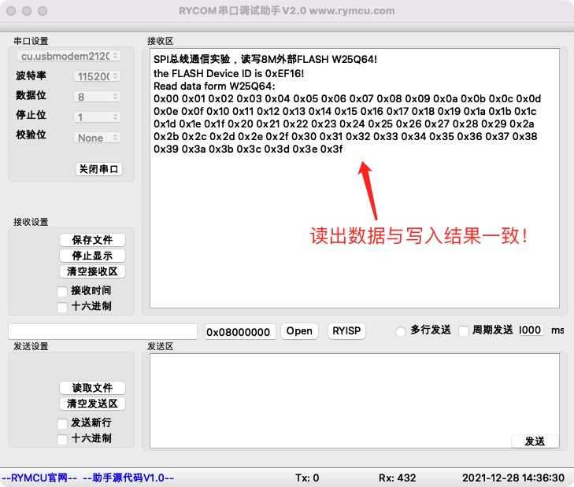

# SPI通信

## 1.  前期准备

安装好`STM32CubeMX`

安装好`Clion`

## 2.创建项目

**开启 `SPI1`，因开发板外部 `Flash W25Q64`和单片机之间通过 `SPI1`实现通信。如下图所示，`SPI1`模式选择 `Full-Duplex-Master`，4处分频系数改为 `16`将波特率设置为 `4.5Mbit/s`。如下图所示。**



配置`FLASH`片选引脚`PA1`为上拉输出，如下图所示。



## 3.编辑代码

`main.c`文件中自动生成了`SPI`对象以及初始化代码：

```c
 //I2C1对象
 SPI_HandleTypeDef hspi1;
 //根据配置自动生成初始化代码，并在main函数中进行了调用
static void MX_SPI1_Init(void)
{
  hspi1.Instance = SPI1;
  hspi1.Init.Mode = SPI_MODE_MASTER;
  hspi1.Init.Direction = SPI_DIRECTION_2LINES;
  hspi1.Init.DataSize = SPI_DATASIZE_8BIT;
  hspi1.Init.CLKPolarity = SPI_POLARITY_LOW;
  hspi1.Init.CLKPhase = SPI_PHASE_1EDGE;
  hspi1.Init.NSS = SPI_NSS_SOFT;
  hspi1.Init.BaudRatePrescaler = SPI_BAUDRATEPRESCALER_16;
  hspi1.Init.FirstBit = SPI_FIRSTBIT_MSB;
  hspi1.Init.TIMode = SPI_TIMODE_DISABLE;
  hspi1.Init.CRCCalculation = SPI_CRCCALCULATION_DISABLE;
  hspi1.Init.CRCPolynomial = 10;
  if (HAL_SPI_Init(&hspi1) != HAL_OK)
  {
    Error_Handler();
  }
}
```

在`main`函数中将调用`MX_SPI1_Init()`完成`SPI`初始化，同时在项目中自动添加了`stm32f1xx_hal_spi.h`,`stm32f1xx_hal_spi.c`文件，其中`1`个关键函数用来实现读写`W25Q64`：

```c
HAL_StatusTypeDef HAL_SPI_TransmitReceive(SPI_HandleTypeDef *hspi, uint8_t *pTxData, uint8_t *pRxData, uint16_t Size,
                                          uint32_t Timeout);
```

参数定义如下：

* hspi ：SPI对象指针 
* pTxData：写数据的buff指针
* pRxData：读出数据存储指针
* Size ：读或写数据大小 
* Timeout ：操作超时时间

`SPI`底层通信已经准备完毕，单片机对`W25Q64`的读、写操作均在上面函数的基础上完成。

## 4.添加W25Q64驱动

项目添加驱动文件`bsp_spi_flash.h`，`bsp_spi_flash.c`，并修改`main.c`代码如下：

```c
//添加头文件支持
#include "bsp_spi_flash.h"
//增加extern
extern SPI_HandleTypeDef hspi1;
```

如上代码所示，需要添加`extern`关键字，原因为`hspi1`对象已经在驱动文件`bsp_spi_flash.h`中定义了，防止重定义而添加。驱动文件中关键函数如下所示：

```c
u16  W25QXX_ReadID(void); 
void W25QXX_WAKEUP(void);                
void SPI_FLASH_SectorErase(u32 SectorAddr);
void SPI_FLASH_BufferWrite(u8* pBuffer, u32 WriteAddr, u16 NumByteToWrite);
void SPI_FLASH_BufferRead(u8* pBuffer, u32 ReadAddr, u16 NumByteToRead);
void SPI_FLASH_PageWrite(u8* pBuffer, u32 WriteAddr, u16 NumByteToWrite);
```

包含`ID`读取、`FLASH`的擦除、读、写等操作，在`main`函数中调用上述函数实现对`W25Q64`的读写。

## 5.读写W25Q64示例

`mian.c`文件中添加全局变量及测试函数：

```c
#define  FLASHBUFFSIZE 64
void SPI_FLASH_Test(void)
{
    uint16_t FLASH_ID;
    uint8_t Flash_Wr_Buff[FLASHBUFFSIZE],Flash_Rd_Buff[FLASHBUFFSIZE];
    printf("SPI总线通信实验，读写8M外部FLASH W25Q64!\r\n",FLASH_ID);
    FLASH_ID = W25QXX_ReadID();//读取W25Q64器件ID
    HAL_Delay(100);
    printf("the FLASH Device ID is 0x%X!\r\n",FLASH_ID);
    //W25Q64 = 8MByte,地址范围：0x000000-0x7FFFFF
    //Sector：每4KB为一个Sector,8M/4K=2048个
    //Block：每64KB为一个Block,8M/64K=128个，每个Block包括16个Sector
    SPI_FLASH_SectorErase(0x00);//擦除第一个Sector
    for (int i = 0; i < FLASHBUFFSIZE; ++i) Flash_Wr_Buff[i] = i;
    SPI_FLASH_BufferWrite(Flash_Wr_Buff,0x00,FLASHBUFFSIZE);
    SPI_FLASH_BufferRead(Flash_Rd_Buff,0x00,FLASHBUFFSIZE);
    printf("Read data form W25Q64: \r\n");
    for(uint16_t i=0;i<FLASHBUFFSIZE;i++)
    {
        printf("0x%02x ",Flash_Rd_Buff[i]);
    }
    printf("\r\n");
}
```

测试函数功能为：读取`WQ2564`器件`ID`，擦除扇区，写数据，并将数据读出打印显示。在`main`函数中调用`SPI_FLASH_Test()`。

## 6.编译下载

将程序编译下载至开发板，并将开发板连接至`PC`,打开串口调试助手`RYCOM`，并设置为：`115200+8+N+1`，接收结果如下。



## 7.小节

本章学习了通过`SPI`总线读写`FLASH`器件`W25Q64`，掌握了基本的读写操作。
