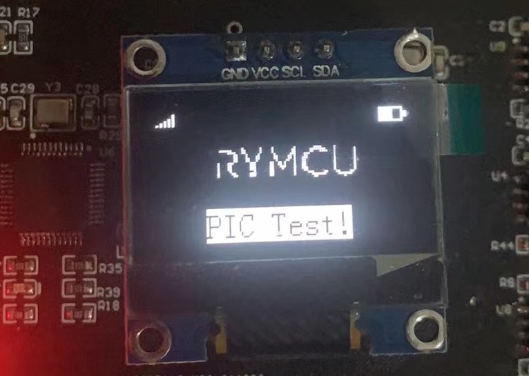

# STM32 HAL库IIC协议控制0.96 OLED液晶显示

## 1.  前期准备

安装好`STM32CubeMX`

安装好`Clion`

`0.96 OLED`介绍以及基础代码详见《跟着`Hugh`学开发--`51`单片机篇`.pdf`》(`https://gitee.com/rymcu-community/nebula-pi`)第二十章，在上述基础代码之上适配`STM32`。

## 2.创建项目

将`bmp.h`、`oled.h`、`oledfont.h`、`oled.c`添加至工程现有项目中，`51`课程中使用`IO`口模拟的`IIC`总线，`STM32`我们使用`HAL`库的`IIC`函数，将上述文件中涉及到`IIC`操作的，均进行替代即可。

**step1 `IIC`对象声明**

将`IIC`对象声明及初始化放入`oled.h`,`oled.c`文件中，因为`oled.c`中需要使用到。

```c
//oled.h中添加头hal文件支持
#include "stm32f1xx_hal.h"
//oled.h中声明
extern I2C_HandleTypeDef hi2c1;
```

`oled.c`中添加对象初始化：

```c
//oled.c中初始化
I2C_HandleTypeDef hi2c1;
```

**step2 使用`HAL`库函数替换模拟`IIC`函数**

`oled.c`修改如下：

```c
/**********************************************
// IIC Write Command
**********************************************/
void Write_IIC_Command(unsigned char IIC_Command)
{
    //使用HAL函数替代
   HAL_I2C_Mem_Write(&hi2c1,0x78,0x00,I2C_MEMADD_SIZE_8BIT,&IIC_Command,1,100);
}
/**********************************************
// IIC Write Data
**********************************************/
void Write_IIC_Data(unsigned char IIC_Data)
{
    //使用HAL函数替代
    HAL_I2C_Mem_Write(&hi2c1,0x78,0x40,I2C_MEMADD_SIZE_8BIT,&IIC_Data,1,100);
}
```

只需修改上述`2`个函数即可，其他均保持不变。

**step3 `main.c`文件中添加头文件支持**

```c
#include "oled.h"
#include "bmp.h"
```

同时`main.c`中需要在`IIC`对象前添加`extern`关键字，因为对象声明已经挪到`oled.h`中了，更改如下：

```c
//添加关键字extern
extern I2C_HandleTypeDef hi2c1;
```

至此，完成了驱动代码修改。

## 3.OLED显示示例

在`main.c`中添加代码测试代码：

```c
//0.96 OLED测试
void OLED_IIC_Test(void)
{
    OLED_Init();//初始化OLED
    OLED_Clear();//清除屏幕
    OLED_Display_On();//开启OLED

/*****************************************
    *
    *0.96 OLED 字符显示测试
    *
*******************************************/
    OLED_ShowChar( 0,0,'A',16,0);
    OLED_ShowChar( 8,0,'B',16,0);
    OLED_ShowChar(16,0,'C',16,0);
    OLED_ShowChar(24,0,'D',16,0);

    OLED_ShowChar( 0,2,'A',8,0);
    OLED_ShowChar( 8,2,'B',8,0);
    OLED_ShowChar(16,2,'C',8,0);
    OLED_ShowChar(24,2,'D',8,0);

    OLED_ShowString(25,6,"Char Test!",16,1);

    HAL_Delay(5000);
    OLED_Clear();//清除屏幕

/*****************************************
    *
    *0.96 OLED 数字显示测试
    *
*******************************************/

    OLED_ShowNum(  0,1,12,2,16,0);
    OLED_ShowNum( 48,1,34,2,16,0);
    OLED_ShowNum( 96,1,56,2,16,0);

    OLED_ShowString(25,6,"Num Test!",16,1);

    HAL_Delay(5000);
    OLED_Clear();//清除屏幕

/*****************************************
    *
    *0.96 OLED 中文显示测试
    *
*******************************************/
    OLED_ShowCHinese(22   ,3,1,0);//不
    OLED_ShowCHinese(22+16,3,2,0);//见
    OLED_ShowCHinese(22+32,3,3,0);//不
    OLED_ShowCHinese(22+48,3,4,0);//散
    OLED_ShowCHinese(22+64,3,5,0);//！

    OLED_ShowString(25,6,"CHN Test!",16,1);

    HAL_Delay(5000);
    OLED_Clear();//清除屏幕

/*****************************************
    *
    *0.96 OLED 字符串显示测试
    *
*******************************************/

    OLED_ShowString(0,2,"Nebula-Pi,RYMCU!",16,0);
    OLED_ShowString(25,6,"Str Test!",16,1);
    HAL_Delay(5000);
    OLED_Clear();//清除屏幕
/*****************************************
    *
    *0.96 OLED 图片显示测试
    *
*******************************************/

    OLED_DrawBMP(0,0,Logo,0);//显示图片
    OLED_ShowString(25,6,"PIC Test!",16,1);
    HAL_Delay(5000);
}
```

## 4.编译下载

将程序编译下载至开发板，观察OLED显示效果，最后图片显示效果如下：

## 5.小节

本章学习了通过`IIC`协议控制`0.96 OLED`。
